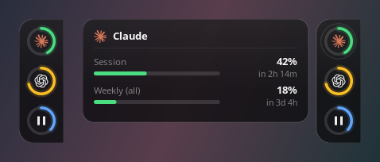

# linotch

A small pill on the edge of your screen: one ring per coding assistant showing how
much of its limit you have burned, and one for whatever is playing — which is also
the play/pause button.

<p align="center"></p>
<p align="center"><sub>Shut, with a ring hovered, and with the right-click menu open. Sample data.</sub></p>

Linux only, and Wayland-first: the notch is a real `wlr-layer-shell` surface, not a
window nudged into place. It signs in nowhere — every reading is borrowed from a
credential a tool on your machine already holds.

## What it shows

| Ring | Source | How |
|---|---|---|
| **Claude** | Claude Code's OAuth token in `~/.claude/.credentials.json` | `api.anthropic.com/api/oauth/usage` — the same session and weekly windows `/usage` reports |
| **Codex** | The ChatGPT session in `~/.codex/auth.json` | `chatgpt.com/backend-api/wham/usage` — 5-hour and weekly windows |
| **Media** | Any MPRIS player on the session bus | Track progress; click to play/pause |

A ring appears only when that tool is installed *and* signed in. The arc shows the
window closest to its limit — the one that will actually stop you. Hovering opens a
card beside it with every window, its own colour grade, and when it resets.

Each ring carries its provider's own mark and its percentage underneath; the media
ring carries the player's own application icon and the track position, and falls
back to a play/pause control when the theme has no icon for it.

Nothing is ever invented: when a vendor stops answering, the last reading stays,
dimmed, and the card says why it is old. A rejected token says so, and says that
using the tool once will refresh it. A rate limit is waited out for exactly as long
as the vendor's own `Retry-After` asks — asking again early is what keeps a limit
alive instead of letting it lapse.

Media works with anything that speaks MPRIS — Spotify, VLC, mpv, Firefox, Chromium,
KDE's browser integration — because that is the interface the desktop's own media
controls use. No helper binary, no per-player code.

## Display servers

The one genuinely per-environment part lives behind a trait in
[`src/surface.rs`](src/surface.rs).

| Surface | Environments | Mechanism |
|---|---|---|
| `LayerShell` | KDE/KWin, Hyprland, sway, wayfire, river, labwc | `zwlr_layer_shell_v1`, Overlay layer |
| `X11Dock` | any X11 session — KDE X11, XFCE, i3, Cinnamon, MATE | `_NET_WM_WINDOW_TYPE_DOCK`, kept above, moved by coordinate |
| `Floating` | Wayland without layer-shell — GNOME/Mutter | a plain window; Mutter lets no client place itself, so this degrades honestly rather than failing silently |

Detection is automatic. To override it:

```bash
LINOTCH_SURFACE=x11 linotch
```

**Adding an environment**: write a struct, `impl Surface` for it, add one arm to
`detect()`. `prepare()` runs before the window is realized, `place()` after it is
shown and on every size change. Nothing else in the codebase needs to know.

## Install

Needs GTK 3, gtk-layer-shell and a Rust toolchain.

```bash
sudo pacman -S --needed gtk3 gtk-layer-shell rust     # Arch / CachyOS
# Debian/Ubuntu: libgtk-3-dev libgtk-layer-shell-dev
```

```bash
cargo build --release
install -Dm755 target/release/linotch ~/.local/bin/linotch
```

Start it with your session:

```bash
install -Dm644 linotch.desktop ~/.config/autostart/linotch.desktop
```

## Use

Hover a ring for its card. Click the media ring to play/pause. Right-click anywhere
on the notch for the menu.

**Drag it.** Press and hold on the notch and move: it slides along its edge, and on
release it snaps to whichever edge the pointer ended up nearest — the four regions
being the triangles the screen's diagonals cut. It can only ever come to rest on an
edge, never adrift in the middle.

The edge is decided on release rather than continuously on purpose. Re-anchoring a
mapped `layer-shell` surface is not reliably picked up (KWin reads the anchor when
the surface is created), so switching mid-drag left the notch attached to nothing.
On release it happens once, and the surface is re-created rather than nudged.

Where it ends up is saved to `~/.config/linotch/config.json` and restored on the
next start. `LINOTCH_EDGE` / `LINOTCH_OFFSET` still win when set, so a one-off
override does not overwrite what you placed by hand.

Cards and the menu open *inward*, away from the bezel — leftwards from a right-edge
notch, downwards from a top one — and they grow out of the tail on a spring that
overshoots slightly, so a panel reads as coming out of the notch rather than
appearing beside it. The menu is drawn in the same skin for the same reason: GTK's
own menu is a separate window, and a Wayland compositor puts that in the middle of
the screen, nowhere near what was clicked.

Usage is re-read every three minutes. That is deliberate: a limit window does not
move fast enough to be worth a per-minute poll, and the vendors answer a burst with
a Retry-After measured in half hours. "Refresh now" in the right-click menu skips
the wait.

```bash
linotch --check      # what each source reports, and why one is missing
linotch --help
```

| Variable | Default | |
|---|---|---|
| `LINOTCH_EDGE` | `right` | `right`, `left`, `top`, `bottom` |
| `LINOTCH_OFFSET` | `0.5` | position along that edge, `0.0`–`1.0` |
| `LINOTCH_OPACITY` | `1.0` | panel opacity, `0.35`–`1.0` |
| `LINOTCH_SURFACE` | auto | `layer`, `x11`, `floating` |

The notch is solid black by default, as upstream's is. `LINOTCH_OPACITY=0.8` makes
it translucent — not blurred: blurring behind a surface needs the compositor's own
protocol (`org_kde_kwin_blur` on KWin, nothing portable), and no client can do it
for itself. Opacity is the part that is honest everywhere.

## Design

The look is codenotch's, taken from its source rather than eyeballed from its
screenshots. Upstream measured every distance off a 2000×2000 design frame and
anchored the scale on one value — the provider ring is 44pt across and 117px in the
frame — so [`src/draw.rs`](src/draw.rs) reproduces the same ratios from the same
numbers, and the palette (`#00FF88` / `#F2FF00` / `#FF3F00`, `#303030` track,
`#808080` secondary text) is upstream's sampled values.

That includes the parts that carry the character: the inverse-rounded flares where
the body meets the bezel, the thin progress arc riding down the middle of the thick
track, the percentage under each ring, and the tail on the hover card.

One thing is deliberately different. codenotch draws the card in a second window;
linotch has a single surface, so the card lives inside it. A layer-shell surface is
anchored by its centre along its edge, which means any change to the window's
*length* moves the rail by half of it — so the length is computed from the tallest
card any ring could open, hovered or not, and only the depth changes when a card
opens. Without that the rail slides up and down as the pointer crosses the rings.

## When a ring is missing

`linotch --check` says why, per source. The usual answers:

- **`token expired — run \`claude\` once to refresh it`** — `~/.claude/.credentials.json`
  is written by the Claude Code **CLI**. If you only ever use Claude Code inside the
  desktop app, that file is never refreshed and its access token goes stale within
  hours. Running `claude` in a terminal once rewrites it. linotch deliberately does
  not refresh it itself: it borrows credentials, it does not manage them.
- **`rate limited — retry in …`** — the vendor's own `Retry-After`, waited out in
  full. Repeated failed auth is what earns one, which is why a token already known
  to be expired is never sent.
- **`not installed`** — no credential file for that tool on this machine.

## Adding a provider

Implement `Provider` in [`src/providers.rs`](src/providers.rs) and add it to `all()`.
`present()` must be cheap and offline — it decides whether a ring is drawn at all,
before any network call. Two rules the existing ones follow:

- **Borrow, never manage.** Read the credential the tool already wrote; never refresh
  it, never write it back. A 401 is not an error to fix here, it is the tool's job.
- **Never invent a number.** Return an error and let the last reading go stale rather
  than showing a zero that looks like a reading.

## Credits

Provider marks are from [lobe-icons](https://github.com/lobehub/lobe-icons) (MIT) —
see [`assets/NOTICE.md`](assets/NOTICE.md). They remain the trademarks of their
owners.

The idea, the design, and the provider wire formats all come from
[vinzdg/codenotch](https://github.com/vinzdg/codenotch) (MIT) — a macOS app with a
Windows port. This is a separate Linux implementation rather than a fork: no code is
shared, and the surface layer, the drawing, the media ring and the providers are
written for GTK/Wayland. What *is* shared is the design, on purpose and with its
numbers taken from upstream's own source.

## License

MIT
